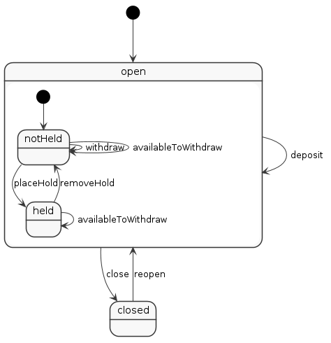

Java Statecharts
================

This repository is a playground for experimenting with state machines and statecharts in Java.

The initial work is heavily influenced by Reginald Braithwaite's excellent blog posts:

- [How I Learned to Stop Worrying and ❤️ the State Machine](http://raganwald.com/2018/02/23/forde.html)
- [More State Machine ❤️: From Reflection to Statecharts](http://raganwald.com/2018/03/03/reflections.html)

See the commit history for a follow-along of the blog posts in Java.

Work so far
-----------

There's a reasonably readable state machine in [AccountState](src/main/java/uk/gov/ida/statechart/AccountState.java) which works in the same way as the JavaScript machine in raganwald's blog.

There's also code in [StatechartAnalyzer](src/main/java/uk/gov/ida/reflection/StatechartAnalyzer.java) which uses 
reflection to generate a machine-readable description of the state machine, and [PlantUmlPrinter](src/main/java/uk/gov/ida/reflection/PlantUmlPrinter.java) which generates a UML diagram (via Plant UML).

The diagram of the Account machine currently looks like this:

